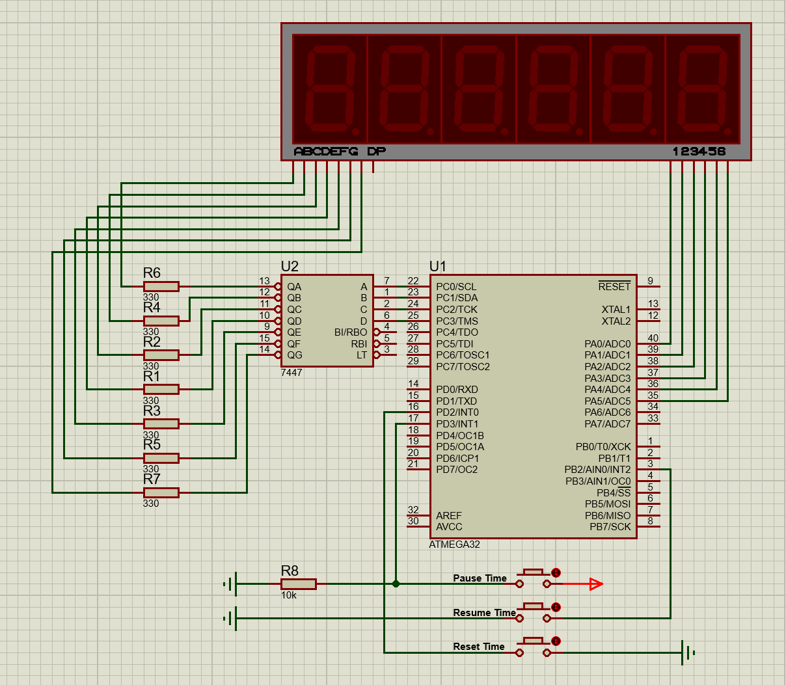

# Stopwatch Project 
The project consist of a display that contain a 6-digit common anode 7-segment. 
The seven segments are being interfaced using a 7447 decoder. 
Atmega32 MCU (with 1Mhz clock ) is used to maintain the clock and the interrupts. 
# Circuit Digram

# Main functionalities 
 * Multiplexed 6-digit 7-segemnt that display the seconds, minutes and hoours. 
 * Pasue de-bounced button using an external interrupt. 
 * resume de-bounced button using an external interrupt. 
 * Reset de-bounced button using an external interrupt. 
 * 7447 Binary to decimal decoder. 
 * High persicion second calculation using compare mode using timer 1. w

# Project Modulation and Structure
The project has 3 Modules. 

1) **clock Module:**
	* Time struct. 
	* init_time() to initialize a structure of type time to zero. 
	* advance_second() to increment a time structure by 1 second. 
	* advance_minute() Helper function for advance_second(). 
	* advance_hour() Helper function for advance_second().
	* display_clock() to display the clock digits from right to left . 
	* get_digit() helper function for display_clock() function. 
	* all function should return a SUCCESS code or and ERROR code. 
	* static function maintain the usability of some functions. 

2) **Intterupts module:**
	* cotain the configuration functions for all 3 extrnal interrupts. 
	* contain all 3 ISRs for the 3 external interrupts.

3) **Timer module:** 
	* contain the configuration function for timer 1 on ctc mode. 
	* Timer_resume() to resume the timer counting. 
	* Timer_pasue() to pause the timer counting. 
	* Timer_reset() to reset the timer counting to 0. 
